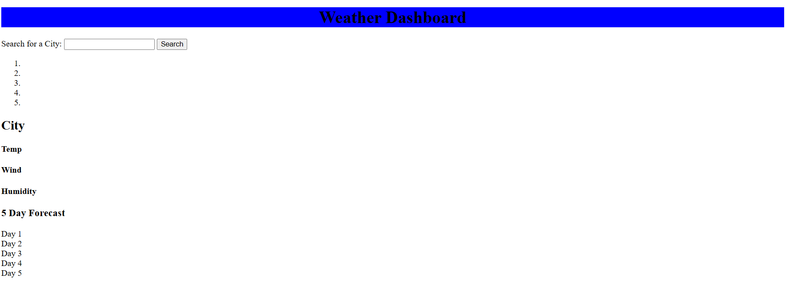

## Assignment
We are assigned to make a weather dashboard using local storage and a weather api provided to us
## Acceptance Criteria
GIVEN a weather dashboard with form inputs
WHEN I search for a city
THEN I am presented with current and future conditions for that city and that city is added to the search history
WHEN I view current weather conditions for that city
THEN I am presented with the city name, the date, an icon representation of weather conditions, the temperature, the humidity, and the wind speed
WHEN I view future weather conditions for that city
THEN I am presented with a 5-day forecast that displays the date, an icon representation of weather conditions, the temperature, the wind speed, and the humidity
WHEN I click on a city in the search history
THEN I am again presented with current and future conditions for that city
## Notes
Generate Cards for the 5-day weather report that appear as the app opens
## Links
Github https://github.com/DewYourWorst/weather-dashboard
Live https://dewyourworst.github.io/weather-dashboard/assets/index.html
## Screenshots
